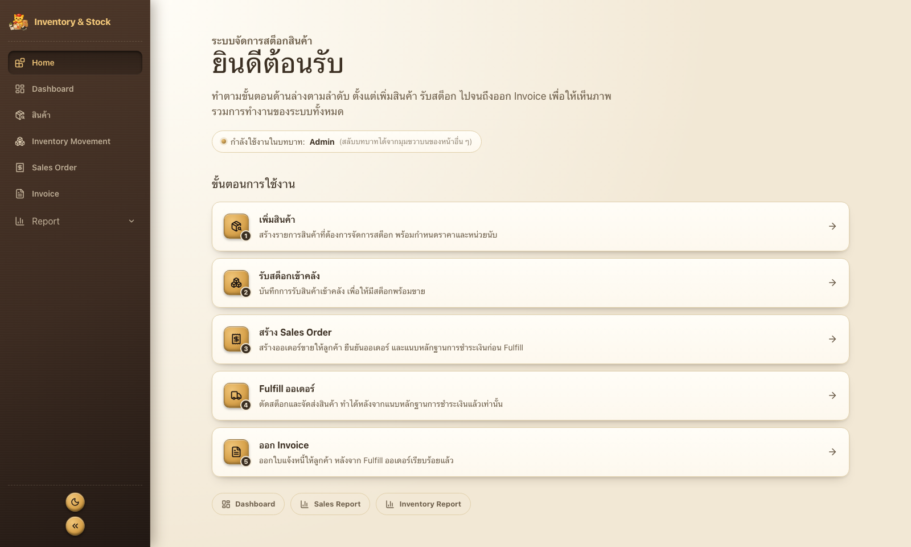
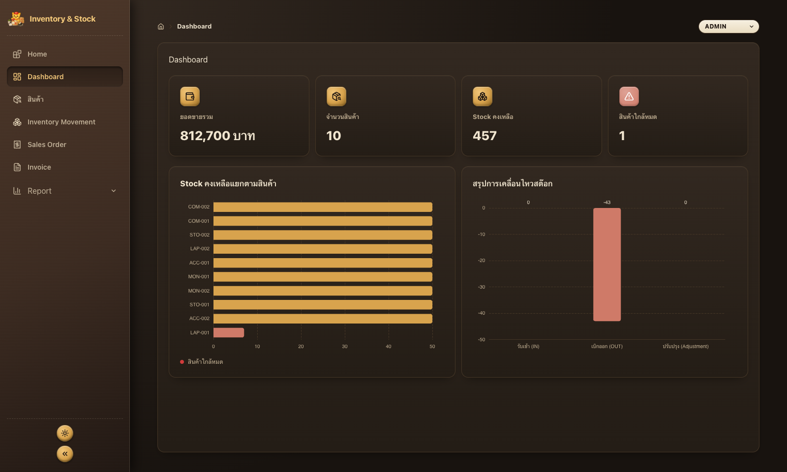
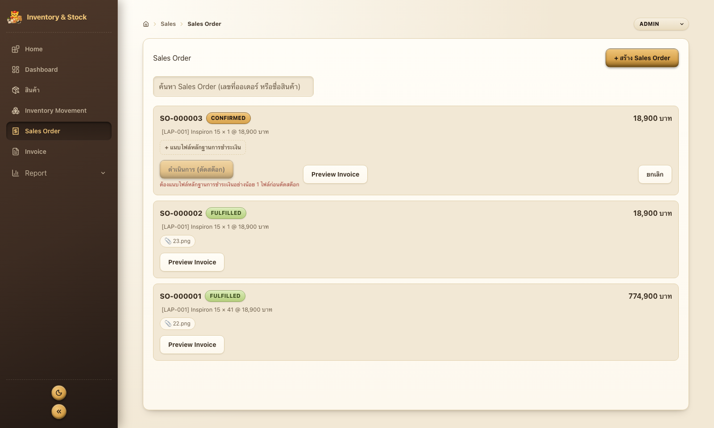
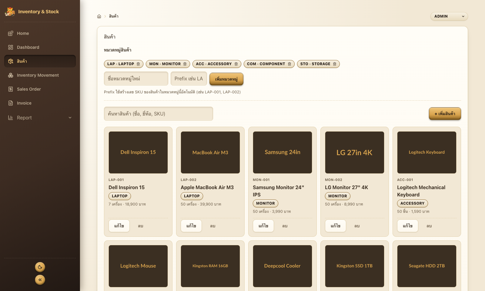
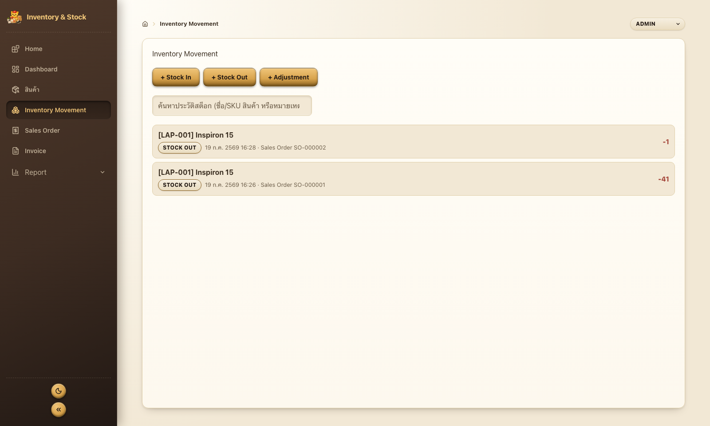
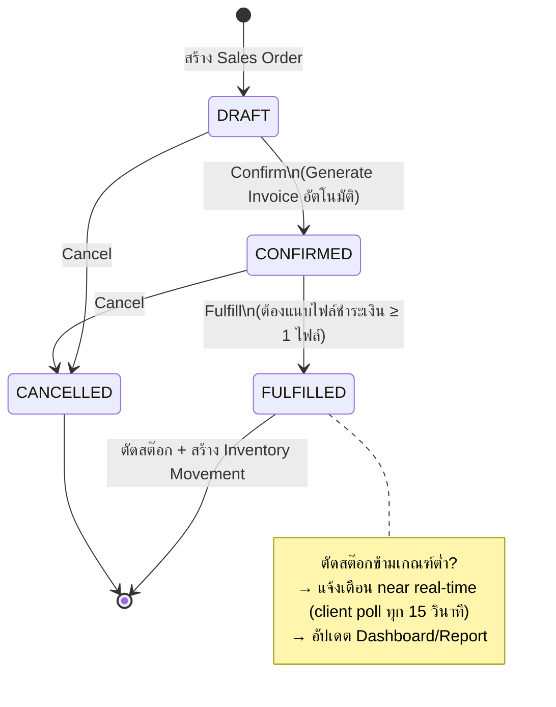
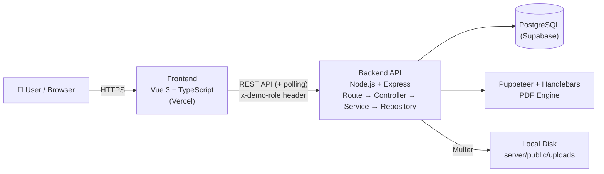

<div align="center">



<h1>📦 Inventory & Stock System</h1>

<p>
ระบบบริหารจัดการการขายและคลังสินค้า (Mini ERP) - จำลอง Workflow จริงของธุรกิจตั้งแต่<br/>
<b>สร้าง Sales Order → ออก Invoice → แนบหลักฐานการชำระเงิน → ตัดสต๊อก → รายงานผล</b><br/>
ออกแบบและพัฒนาทั้งระบบ ตั้งแต่ Database Schema, Business Logic, Role Permission ไปจนถึง UI/UX
</p>

<p>


</p>

</div>

---

## สารบัญ

- [Overview](#-overview)
- [ภาพหน้าจอ](#-ภาพหน้าจอ)
- [ขอบเขตระบบ](#-ขอบเขตระบบ-system-scope)
- [Business Workflow](#-business-workflow)
- [Demo Role & Permission Matrix](#-demo-role--permission-matrix)
- [Tech Stack](#-tech-stack)
- [System Architecture](#-system-architecture)
- [เริ่มต้นใช้งาน](#-เริ่มต้นใช้งาน-getting-started)
- [โครงสร้างโปรเจกต์](#-โครงสร้างโปรเจกต์)
- [สถานะโปรเจกต์](#-สถานะโปรเจกต์)

---

## 🔎 Overview

ไม่ใช่ CRUD ตัวอย่างทั่วไป แต่เป็น Mini ERP ที่จำลองปัญหาจริงของธุรกิจ - **ออกแบบ business logic, permission, และสถาปัตยกรรมเองทั้งหมด**

| | จุดเด่น | รายละเอียด |
|:---:|---|---|
| 🔗 | **Business rule ที่ออกแบบเอง ไม่ใช่ CRUD** | Sales Order ต้องแนบหลักฐานชำระเงินก่อนตัดสต๊อก (ไม่ใช่ก่อน Confirm) จำลอง flow วางบิล → รับเงิน → ส่งของ ของธุรกิจจริง |
| 🔐 | **Permission บังคับ 2 ชั้น** | Server middleware + ซ่อน/disable UI ฝั่ง Client ตรงกันครบ 4 role |
| ⚡ | **แก้ปัญหา serverless จริง** | เริ่มด้วย SSE แล้วพบว่าใช้ไม่ได้บน Vercel (คนละ instance ต่อ request) จึงรีดีไซน์เป็น polling |
| 🧾 | **PDF pipeline ใช้งานได้จริง** | Puppeteer + Handlebars, ยอดเงินแปลงเป็นตัวอักษรภาษาไทยอัตโนมัติ |
| 🏗️ | **Layered Architecture ทั้ง 2 ฝั่ง** | Route→Controller→Service→Repository / View→Store→Service→HTTP |

---

## 🖼 ภาพหน้าจอ

<table>
<tr>
<td width="50%"></td>
<td width="50%"></td>
</tr>
<tr>
<td align="center"><sub>Dashboard - Light Theme</sub></td>
<td align="center"><sub>Dashboard - Dark Theme (สลับได้จากปุ่มมุมล่างของ Sidebar)</sub></td>
</tr>
<tr>
<td width="50%"></td>
<td width="50%"></td>
</tr>
<tr>
<td align="center"><sub>Sales Order - เห็นสถานะ, gate การแนบไฟล์ก่อน Fulfill, ปุ่ม Preview Invoice</sub></td>
<td align="center"><sub>Product Management - จัดการสินค้า/หมวดหมู่ พร้อมรูปภาพ</sub></td>
</tr>
<tr>
<td colspan="2"></td>
</tr>
<tr>
<td colspan="2" align="center"><sub>Inventory Movement - ประวัติการเคลื่อนไหวสต๊อกทุกประเภท (In/Out/Adjustment) พร้อมอ้างอิง Sales Order ต้นทาง</sub></td>
</tr>
</table>

---

## 📋 ขอบเขตระบบ (System Scope)

ระบบประกอบด้วย 4 module หลัก ทำงานต่อเนื่องกันเป็น workflow เดียว:

<details open>
<summary><b>1. Product Management (Sales)</b> - จัดการข้อมูลสินค้า</summary>

- ดูข้อมูลสินค้า, ค้นหาสินค้า (ชื่อ/ยี่ห้อ/SKU)
- ตรวจสอบราคาสินค้าและจำนวน Stock คงเหลือ
- จัดการหมวดหมู่สินค้า (เพิ่ม/ลบ) - ใช้สร้างเลข SKU อัตโนมัติตาม prefix ของหมวดหมู่
- เพิ่ม/แก้ไขสินค้า พร้อมอัปโหลดรูปภาพสินค้า (preview ขนาดเต็ม, คลิกดูรูปจริงได้)
</details>

<details>
<summary><b>2. Inventory Management (Warehouse)</b> - จัดการคลังสินค้า</summary>

- รับสินค้าเข้า (Stock In) / เบิกสินค้าออก (Stock Out) / ปรับปรุงจำนวนสินค้า (Stock Adjustment) ผ่าน dialog เดียว
- ดูประวัติการเคลื่อนไหวของสินค้า (Inventory Movement) พร้อมค้นหาจากชื่อ/SKU/หมายเหตุ
- แจ้งเตือนสินค้าใกล้หมดแบบ near real-time (poll ทุก 15 วินาที + toast)
</details>

<details>
<summary><b>3. Sales Order & Invoice</b> - คำสั่งขายและเอกสารทางการขาย</summary>

- สร้าง Sales Order ผ่าน Dialog เพิ่มรายการสินค้าได้หลายบรรทัด (กันเลือกสินค้าซ้ำในออเดอร์เดียว) พร้อมแสดงรูป/สต๊อกคงเหลือประกอบการเลือก และคำนวณยอดรวมอัตโนมัติ
- ยืนยันคำสั่งขาย (Confirm) → สร้าง Invoice อัตโนมัติ
- แนบไฟล์หลักฐานการชำระเงิน (ต้องมีอย่างน้อย 1 ไฟล์ก่อนคลังตัดสต๊อกได้)
- คลังดำเนินการตัดสต๊อก (Fulfill) เมื่อมีหลักฐานการชำระเงินแล้วเท่านั้น
- ยกเลิกคำสั่งขาย (Cancel) พร้อม confirm dialog
- ติดตามสถานะ Order (DRAFT / CONFIRMED / FULFILLED / CANCELLED), ค้นหาจากเลขที่ออเดอร์หรือชื่อสินค้า
- Preview Invoice ได้ทันทีจากหน้า Sales Order, พิมพ์/ดาวน์โหลดเป็น PDF รายใบ
</details>

<details>
<summary><b>4. Dashboard & Reporting</b> - ภาพรวมและรายงาน</summary>

- KPI Card: ยอดขาย, จำนวนสินค้า, Stock คงเหลือ, สินค้าใกล้หมด
- กราฟ Stock คงเหลือแยกตามสินค้า และกราฟสรุปการเคลื่อนไหวสต๊อก (ECharts)
- Sales Report / Inventory Report พร้อม filter ช่วงวันที่, Export เป็น CSV, Generate/Preview เป็น PDF
- แจ้งเตือนสินค้าใกล้หมดแบบ near real-time (poll ทุก 15 วินาที) ทันทีที่สต๊อกตัดข้ามเกณฑ์ต่ำ
</details>

นอกจากนี้ยังมี **Usability pass ทั่วระบบ**: toast แจ้งผลลัพธ์ทุก action, confirm dialog แทน `window.confirm`, validation รายช่องในฟอร์ม, dialog รองรับ keyboard เต็มรูปแบบ (focus trap), หน้าแรกแนะนำ workflow แบบ step-by-step สำหรับผู้ใช้ใหม่

---

## 🔄 Business Workflow



---

## 🔑 Demo Role & Permission Matrix

ระบบใช้ **Demo Role** (ยังไม่มีระบบ Login จริง) จำลองการทำงานของแต่ละฝ่ายผ่าน header `x-demo-role` - สลับ role ทดสอบสิทธิ์ได้จากมุมขวาบนของทุกหน้า

| Feature | Admin | Sales | Warehouse | Viewer |
|---|:---:|:---:|:---:|:---:|
| Dashboard | ✅ | ✅ | ✅ | ✅ |
| ดูสินค้า | ✅ | ✅ | ✅ | ✅ |
| จัดการสินค้า | ✅ | ❌ | ❌ | ❌ |
| สร้าง / ยืนยัน / ยกเลิก Sales Order | ✅ | ✅ | ❌ | ❌ |
| แนบไฟล์หลักฐานการชำระเงิน | ✅ | ✅ | ❌ | ❌ |
| ดำเนินการตัดสต๊อก (Fulfill) | ✅ | ❌ | ✅ | ❌ |
| ดู Invoice / พิมพ์ PDF | ✅ | ✅ | 👁️ | 👁️ |
| Stock In / Stock Out / Adjustment | ✅ | ❌ | ✅ | ❌ |
| Inventory Movement | ✅ | 👁️ | ✅ | 👁️ |
| แจ้งเตือนสินค้าใกล้หมด (near real-time) | ✅ | ✅ | ✅ | ✅ |
| Report | ✅ | ✅ | ✅ | ✅ |

`✅ ใช้งานได้` · `👁️ ดูอย่างเดียว` · `❌ ไม่มีสิทธิ์` - บังคับสิทธิ์ทั้งฝั่ง Server (middleware `requireRole`) และฝั่ง Client (UI)

---

## 🛠 Tech Stack

| Layer | Technology |
|---|---|
| **Frontend** | Vue 3 (Composition API), TypeScript, Pinia (Option Store), Vue Router, Tailwind CSS v4, ECharts, Vite |
| **Backend** | Node.js, Express, TypeScript (`tsx`) |
| **Database** | PostgreSQL ผ่าน [Supabase](https://supabase.com) (คุยผ่าน `pg` โดยตรง ไม่ใช้ ORM) |
| **Document/PDF** | Puppeteer + Handlebars (Invoice, Sales/Inventory Report) |
| **Notification** | Polling ทุก 15 วินาที + diff ฝั่ง client (แจ้งเตือนสินค้าใกล้หมด - เดิมใช้ SSE แต่ปรับเพราะใช้ไม่ได้บน serverless) |
| **File Upload** | Multer (รูปสินค้า, สลิปหลักฐานการชำระเงิน) |
| **Deployment** | Vercel (Frontend), Supabase (Database) |

---

## 🏛 System Architecture



รายละเอียดสถาปัตยกรรมและโครงสร้างโค้ดแต่ละฝั่ง: [client/README.md](client/README.md) · [server/README.md](server/README.md)

---

## 🚀 เริ่มต้นใช้งาน (Getting Started)

### สิ่งที่ต้องมี

- Node.js 18+
- โปรเจกต์ Supabase (ใช้ฟรี tier ได้) สำหรับ PostgreSQL

### 1) Clone และติดตั้ง

```sh
git clone https://github.com/golffer420014/Inventory-Stock-System.git
cd Inventory-Stock-System

cd server && npm install
cd ../client && npm install
```

### 2) ตั้งค่า Environment

```sh
cd server
cp .env.example .env
# แก้ DATABASE_URL, SUPABASE_URL, SUPABASE_SECRET_KEY ฯลฯ ให้ตรงกับ Supabase project ของตัวเอง
```

รัน migration ตามลำดับใน `server/database/migrations/*.sql` กับฐานข้อมูล Supabase (ไม่มี migration runner อัตโนมัติ ใช้ SQL Editor ของ Supabase รันตรงได้) แล้ว seed ข้อมูลตั้งต้นจาก `server/database/seeds/`

### 3) รันโปรเจกต์ (2 terminal)

```sh
# Terminal 1 - Backend (http://localhost:4000)
cd server && npm run dev

# Terminal 2 - Frontend (http://localhost:5173)
cd client && npm run dev
```

เปิด `http://localhost:5173` แล้วสลับ Demo Role ทดสอบสิทธิ์แต่ละฝ่ายได้จากมุมขวาบน

รายละเอียด script/env ของแต่ละฝั่งเพิ่มเติม: [client/README.md](client/README.md) · [server/README.md](server/README.md)

---

## 📁 โครงสร้างโปรเจกต์

```
Inventory-Stock-System/
├── client/              # Frontend - Vue 3 + TypeScript (client/README.md)
├── server/              # Backend - Node.js + Express + TypeScript (server/README.md)
│   └── database/
│       ├── migrations/  # SQL schema migration
│       └── seeds/       # ข้อมูลตั้งต้นสำหรับทดสอบ
└── docs/screenshots/    # ภาพหน้าจอประกอบ README
```

---

## 📌 สถานะโปรเจกต์

MVP ครบ 4 module หลักตาม System Scope แล้ว ทดสอบ flow หลักและสิทธิ์ตาม Role ครบทุก Role ทั้ง Backend และ Frontend แล้ว

<details>
<summary><b>Completed</b></summary>

- Project Planning / System Scope / Business Workflow Design / Role Permission Design
- Database Design (PostgreSQL ผ่าน Supabase)
- Backend API และ Frontend ครบทั้ง 4 module
- Sales Order & Invoice workflow แบบเต็ม (Create → Confirm → แนบไฟล์การชำระเงิน → Fulfill → ตัดสต๊อก)
- Invoice PDF generation รายใบ, Sales/Inventory Report พร้อม Export CSV และ PDF
- Dashboard พร้อมกราฟ (ECharts) และ KPI Card
- แจ้งเตือนสินค้าใกล้หมดแบบ near real-time (polling) - ออกแบบใหม่ให้รองรับ serverless หลังพบว่า SSE เดิมใช้ไม่ได้บน Vercel
- หน้าแรก (Home) แนะนำ workflow แบบ step-by-step สำหรับผู้ใช้ใหม่
- Usability pass ทั่วระบบ: toast, confirm dialog, validation รายช่อง, focus trap, ค้นหาในลิสต์ยาว
- จัดรูปแบบ PDF ใหม่เป็นเอกสารทางการ (header บริษัท, ยอดเงินเป็นตัวอักษรภาษาไทยอัตโนมัติ)
- ทดสอบสิทธิ์การใช้งานตาม Role ครบทุก Role ทั้งฝั่ง Server (API) และ Client (UI)
</details>

<details>
<summary><b>Future Improvements</b></summary>

- Authentication System (ระบบ Login จริง แทน Demo Role)
- Purchase Order / Supplier Management
- Accounting Module
- Payment Gateway Integration / การกระทบยอดชำระเงินแบบเต็มรูปแบบ
- Audit Log
- ข้อมูลบริษัทใน PDF (ชื่อ/ที่อยู่/เลขผู้เสียภาษี/บัญชีธนาคาร) ยังเป็นค่า placeholder - ยังไม่มีที่เก็บข้อมูลบริษัทจริงในระบบ
</details>
