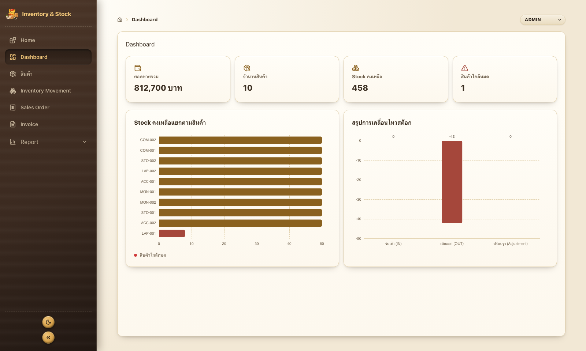
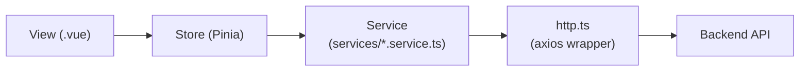

# Client — Inventory & Stock System (Frontend)

<p>


</p>

Frontend ของระบบ Inventory & Stock System (Mini ERP) พัฒนาด้วย Vue 3 + TypeScript

> ภาพรวมทั้งระบบ (Business Workflow, Role Permission, Tech Stack, Screenshot) ดูได้ที่ [README หลักของโปรเจกต์](../README.md)



---

## Stack

- **Vue 3** — `<script setup lang="ts">` ล้วน
- **TypeScript**
- **Vue Router**
- **Pinia** (Option Store เท่านั้น — ดูกฎด้านล่าง)
- **Tailwind CSS v4**
- **Lucide Vue** — icon
- **ECharts** — กราฟ Dashboard
- **Vite**

## รูปแบบโครงสร้าง (Structure Pattern)

โปรเจกต์นี้ใช้ **Feature-based folder ผสม Layered structure** — แบ่งโฟลเดอร์หลักตาม layer ก่อน (`views`, `components`, `stores`, `services`) แล้วค่อยแบ่งย่อยตาม domain ภายใน layer นั้น (`inventory`, `product`, `sales`, `dashboard`, `report`)

ข้อมูลไหลทางเดียวเสมอในทุกหน้า:



> ดูกฎการเขียนโค้ดใน `.vue` แบบละเอียด (ลำดับ import / store / props / ref / computed / action / event / watch / onMounted) และกฎการตั้งชื่อ interface/type ได้ที่ [CLAUDE.md](./CLAUDE.md)

## โครงสร้างโฟลเดอร์ (Folder Structure)

```txt
client/
├── public/                  # Static asset ที่ไม่ผ่าน build (favicon, mascot ฯลฯ)
└── src/
    ├── components/
    │   ├── common/           # Component กลางที่ใช้ซ้ำได้ทั้งระบบ
    │   │   ├── BaseButton.vue        # variant primary/secondary/ghost/danger
    │   │   ├── BaseInput.vue         # prop `error` → กรอบแดง + ข้อความใต้ช่อง
    │   │   ├── BaseInputNumber.vue   # เหมือน BaseInput แต่ format ตัวเลขมี comma อัตโนมัติ
    │   │   ├── BaseCombobox.vue      # dropdown ค้นหาได้ รองรับ prop `error`
    │   │   ├── BaseDialog.vue        # modal กลาง มี focus trap + คืน focus ให้ trigger ตอนปิด
    │   │   ├── BaseConfirmDialog.vue # confirm dialog แบบ imperative ผ่าน useConfirmStore แทน window.confirm
    │   │   ├── BaseToastStack.vue    # toast รวม (ผลลัพธ์ action + แจ้งเตือนสต๊อกใกล้หมดจาก polling)
    │   │   └── BaseCard.vue, BaseAlert.vue, BaseBadge.vue, BaseSpinner.vue, BaseAsyncState.vue, BaseChart.vue
    │   ├── dashboard/ inventory/ product/ sales/   # Component เฉพาะโดเมนนั้น ๆ
    │   ├── AppSidebar.vue     # เมนูนำทางหลัก + ปุ่มพับ/ขยาย + ThemeToggle
    │   ├── AppBreadcrumb.vue  # Breadcrumb ตำแหน่งหน้าปัจจุบัน
    │   └── ThemeToggle.vue    # ปุ่มสลับ Light/Dark theme
    │
    ├── layouts/
    │   └── DefaultLayout.vue  # Layout หลัก (Sidebar + Breadcrumb + เนื้อหา) — mount BaseConfirmDialog/BaseToastStack ที่นี่
    │
    ├── views/                 # หน้าจอผูกกับ route โดยตรง (1 ไฟล์ = 1 หน้า)
    │   ├── dashboard/ inventory/ product/ report/ sales/
    │   └── HomeView.vue        # หน้าแรก แนะนำ workflow แบบ step-by-step
    │
    ├── router/
    │   └── index.ts            # ตั้งค่า route, meta title, group เมนู
    │
    ├── stores/                 # Pinia (Option Store) แยกตามโดเมน
    │   ├── dashboard.ts inventory.ts invoice.ts product.ts category.ts report.ts salesOrder.ts
    │   ├── notification.ts     # toast แจ้งเตือนสินค้าใกล้หมด รับข้อมูลจาก useNotificationStream (polling)
    │   ├── toast.ts             # toast ทั่วไป — useToastStore().push(message, variant)
    │   ├── confirm.ts           # confirm dialog แบบ imperative — useConfirmStore().ask({...}) คืน Promise<boolean>
    │   ├── role.ts              # Demo Role ปัจจุบันของผู้ใช้ (สลับสิทธิ์ทดสอบ)
    │   └── theme.ts             # สถานะ Light/Dark theme (persist ผ่าน localStorage)
    │
    ├── services/               # HTTP layer แยกตามโดเมน — ไม่มี state, ไม่ผูกกับ Vue
    │   ├── http.ts              # base URL, header (x-demo-role), error handling ร่วม
    │   └── dashboard/inventory/invoice/product/category/report/salesOrder/upload.service.ts
    │
    ├── composables/
    │   ├── usePermission.ts          # ตรวจสิทธิ์ role ปัจจุบันตาม Permission Matrix
    │   └── useNotificationStream.ts  # poll GET /api/notifications/low-stock ทุก 15 วินาที เทียบสต๊อกที่เปลี่ยนแล้ว push เข้า notification store (เดิมใช้ SSE แต่เปลี่ยนเพราะใช้ไม่ได้บน serverless)
    │
    ├── directives/
    │   └── numberFormat.ts     # v-number-format จัดตัวเลขใส่ comma อัตโนมัติใน input
    │
    ├── types/                  # Type/Interface กลาง (prefix `i` = interface, `t` = type alias)
    ├── App.vue                 # Root component
    ├── main.ts                  # Entry point — สร้าง app, ติดตั้ง Pinia/Router/directive
    └── style.css                # Global style, CSS variable ของธีม (leather/brass), Tailwind entry
```

## แนวทาง UI/UX ที่ใช้ร่วมกันทั้งระบบ

| แนวทาง | รายละเอียด |
|---|---|
| **แจ้งผลลัพธ์ทุก action ด้วย toast** | `useToastStore().push(message, 'success' \| 'destructive')` หลัง action สำเร็จเสมอ — ห้ามปิด dialog เงียบ ๆ |
| **ยืนยันก่อน action ทำลายข้อมูล** | `useConfirmStore().ask({ title, message, confirmText, danger })` (คืน `Promise<boolean>`) แทน `window.confirm` — บอก impact ได้ (เช่น จำนวนสินค้าที่ผูกกับหมวดหมู่ที่จะลบ) |
| **Validation รายช่องในฟอร์ม** | ใช้ prop `error` ของ `BaseInput` / `BaseInputNumber` / `BaseCombobox` ชี้ผิดเป็นรายช่อง แทนข้อความ error รวมช่องเดียว |
| **ค้นหาแบบ client-side ในลิสต์ยาว** | `searchKeyword` + computed `filteredXList` เพราะข้อมูลถูกโหลดมาทั้งหมดอยู่แล้ว ไม่ยิง API ซ้ำ |
| **Dialog เข้าถึงได้ด้วยคีย์บอร์ดเต็มรูปแบบ** | `BaseDialog` มี focus trap ในตัว — เปิดแล้ว focus เข้า dialog อัตโนมัติ, `Escape` ปิดได้, คืน focus ให้ trigger ตอนปิด |

## Scripts

```sh
npm install
npm run dev        # start dev server (Vite) — http://localhost:5173
npm run build       # type-check (vue-tsc) แล้ว build
npm run preview     # preview production build
```

## Environment

ตั้งค่าผ่านไฟล์ `.env` (copy จาก `.env.example`):

| ตัวแปร | ค่าเริ่มต้นถ้าไม่ตั้งค่า | ใช้ทำอะไร |
|---|---|---|
| `VITE_API_BASE_URL` | `http://localhost:4000/api` | Base URL ของ Backend API |
| `VITE_APP_NAME` | `Inventory & Stock` | ชื่อระบบที่แสดงบน Sidebar |
