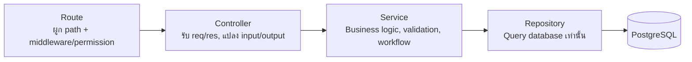

# Server — Inventory & Stock System (Backend)

<p>


</p>

Backend API ของระบบ Inventory & Stock System (Mini ERP) พัฒนาด้วย Node.js + Express + TypeScript

> ภาพรวมทั้งระบบ (Business Workflow, Role Permission, Tech Stack, Screenshot) ดูได้ที่ [README หลักของโปรเจกต์](../README.md)

---

## Stack

- **Node.js** + **Express** + **TypeScript** (รันตรงด้วย `tsx` ระหว่าง dev, ไม่ต้อง build ทุกครั้งที่แก้โค้ด)
- **PostgreSQL** ผ่าน [`pg`](https://node-postgres.com/) (`Pool`) — เชื่อมต่อ Supabase Postgres โดยตรง **ไม่ใช้ ORM**
- **Puppeteer** + **Handlebars** — generate PDF จาก HTML template (Invoice, Sales/Inventory Report)
- **Multer** — รับไฟล์อัปโหลด (รูปสินค้า, สลิปหลักฐานการชำระเงิน) เก็บลงดิสก์ของ server เอง
- **Redis** — เตรียม config ไว้สำหรับ cache ในอนาคต (มีแค่ `REDIS_URL` เก็บไว้ ยังไม่ได้ต่อ client จริง)

## รูปแบบโครงสร้าง (Structure Pattern)

โปรเจกต์นี้ใช้ **Layered Architecture** แบบ **Route → Controller → Service → Repository** แยกความรับผิดชอบแต่ละชั้นให้ชัดเจน:



แยกโฟลเดอร์ตาม **layer ก่อน แล้วแบ่งไฟล์ย่อยตาม domain** ภายในนั้น (`product`, `inventory`, `salesOrder`, `invoice`, `dashboard`, ...)

Domain ที่เป็น CRUD ตรงไปตรงมา ไม่มี transaction/join ซับซ้อน (`product`, `category`, `inventory`) ให้ repository เรียกผ่าน **Active Record base (`models/`)** แทนการเขียน SQL mapRow เอง — ส่วน domain ที่มี transaction หลายตาราง/workflow ซับซ้อน (`salesOrder`, `invoice`, `dashboard`, `report`) repository ยังคุย SQL ตรงผ่าน `pg` Pool/PoolClient

## โครงสร้างโฟลเดอร์ (Folder Structure)

```txt
server/
├── database/
│   ├── migrations/        # SQL migration สำหรับสร้าง/แก้ไข schema
│   └── seeds/              # SQL seed สำหรับเติมข้อมูลตั้งต้น/ทดสอบ
│
└── src/
    ├── routes/             # กำหนดเส้นทาง API + ผูก controller + middleware (requireRole)
    │   └── index.ts          # รวมทุก route ย่อยเข้า apiRouter หลัก (mount ที่ /api)
    │
    ├── controllers/        # รับ request/response โดยตรง เรียก service แล้วส่งผลลัพธ์กลับเป็น JSON
    ├── services/           # Business logic หลัก เช่น คำนวณยอดขาย, สร้าง Invoice, อัปเดต Stock, workflow
    │   └── report.service.ts   # คำนวณ Sales/Inventory Report + สร้างไฟล์ CSV และ PDF (ผ่าน Puppeteer)
    │
    ├── repositories/       # เข้าถึงข้อมูล (data access) เท่านั้น ไม่มี business logic
    │
    ├── models/              # Active Record base — ใช้ใน product/category/inventory repository
    │   └── base.model.ts      # findAll/findById/findOneBy/findManyBy/create/updateById/deleteById/save
    │                          # แปลง camelCase <-> snake_case ให้อัตโนมัติ ไม่ต้องเขียน mapRow เอง
    │                          # (invoice/salesOrder/salesOrderItem model มีไฟล์ไว้แล้วแต่ยังไม่ได้ใช้จริง — repository ยังเป็น SQL ตรง)
    │
    ├── middlewares/
    │   ├── auth.middleware.ts        # Demo auth — อ่าน role จาก header `x-demo-role` (ยังไม่มีระบบ login จริง)
    │   ├── role.middleware.ts        # requireRole(...roles) ตรวจสิทธิ์ตาม Permission Matrix ก่อนเข้าถึง route
    │   ├── upload.middleware.ts      # Multer — เก็บไฟล์อัปโหลด (รูปสินค้า/สลิป) ลง public/uploads
    │   └── errorHandler.middleware.ts # ดักจับ error กลางของแอปแล้วตอบกลับเป็น response ที่เหมาะสม
    │
    ├── config/
    │   ├── env.ts             # รวมค่า env ทั้งหมด
    │   └── database.ts        # ตั้งค่าการเชื่อมต่อฐานข้อมูล
    │
    ├── cache/
    │   └── redis.client.ts    # Redis client (เตรียมไว้ ยังไม่ได้ใช้งานจริง)
    │
    ├── templates/           # Handlebars template ใช้ร่วมกับ Puppeteer — จัดเป็นเอกสารทางการ (header บริษัท/content/footer)
    │   ├── invoice.hbs             # มีช่องทางการชำระเงิน + ยอดเงินเป็นตัวอักษรภาษาไทยที่ footer
    │   ├── salesReport.hbs         # ยอดขายรวมเป็นตัวอักษรภาษาไทยที่ footer
    │   └── inventoryReport.hbs     # สรุปรายงานที่ footer (ไม่มียอดเงิน)
    │
    ├── types/               # Type/Interface กลางที่ใช้ร่วมกันหลายไฟล์ในแต่ละโดเมน
    ├── utils/               # Utility function ที่ใช้ร่วมกันหลาย layer/domain (csv, date, pdf, thaiBahtText)
    ├── app.ts                # ประกอบ Express app (middleware, route, error handler) — ไม่ start server
    └── server.ts              # Entry point — สั่ง app.listen()
```

## Scripts

```sh
npm install
npm run dev      # start dev server ด้วย tsx watch (auto-reload) — http://localhost:4000
npm run build     # compile TypeScript เป็น dist/
npm run start     # รัน production build จาก dist/server.js
```

## Environment

Copy `.env.example` เป็น `.env` แล้วปรับค่าตามการใช้งาน — โปรเจกต์นี้ต่อกับ **Supabase Postgres** โดยตรง (ไม่มี local DB setup)

| ตัวแปร | ใช้ทำอะไร |
|---|---|
| `PORT` | Port ที่ server รัน (default `4000`) |
| `CLIENT_ORIGIN` | Origin ของ frontend สำหรับตั้งค่า CORS |
| `DATABASE_URL` | Connection string ของ Supabase Postgres (ใช้ pooler connection ไม่ใช่ direct — direct เป็น IPv6-only) |
| `REDIS_URL` | เก็บไว้เผื่ออนาคต ยังไม่ได้ใช้งานจริง |
| `SUPABASE_URL` / `SUPABASE_PUBLISHABLE_KEY` / `SUPABASE_SECRET_KEY` / `SUPABASE_JWKS_URL` | เผื่อใช้ตอนต่อ authentication จริงในอนาคต (ปัจจุบันยังไม่ได้ใช้ — auth เป็น Demo Role) |

## API

ทุก endpoint mount อยู่ใต้ `/api` — มี `GET /health` สำหรับตรวจสอบสถานะ server

Request ต้องส่ง header **`x-demo-role`** เพื่อจำลอง role ของผู้ใช้งาน (ระบบยังไม่มี authentication จริง) — สิทธิ์แต่ละ endpoint เป็นไปตาม [Permission Matrix ใน README หลัก](../README.md#-demo-role--permission-matrix)

| Endpoint | Method | Role ที่เข้าถึงได้ |
|---|---|---|
| `/products` | GET | Admin, Sales, Warehouse, Viewer |
| `/products`, `/products/:id` | POST / PUT / DELETE | Admin |
| `/categories` | GET | Admin, Sales, Warehouse, Viewer |
| `/categories`, `/categories/:id` | POST / PUT / DELETE | Admin |
| `/uploads` | POST | Admin, Sales |
| `/inventory/movements` | GET | Admin, Sales, Warehouse, Viewer |
| `/inventory/stock-in`, `/stock-out`, `/adjustment` | POST | Admin, Warehouse |
| `/sales-orders` | GET | Admin, Sales, Warehouse, Viewer |
| `/sales-orders` | POST | Admin, Sales |
| `/sales-orders/:id/payments`, `/confirm`, `/cancel` | POST | Admin, Sales |
| `/sales-orders/:id/fulfill` | POST | Admin, Warehouse |
| `/invoices`, `/invoices/:id/pdf` | GET | Admin, Sales, Warehouse, Viewer |
| `/dashboard/summary` | GET | Admin, Sales, Warehouse, Viewer |
| `/reports/sales`, `/inventory` (+ `/csv`, `/pdf`) | GET | Admin, Sales, Warehouse, Viewer |
| `/notifications/low-stock` | GET | ทุก role (client poll ทุก 15 วินาที) |

ไฟล์ที่อัปโหลดผ่าน `POST /api/uploads` (รูปสินค้า, สลิปหลักฐานการชำระเงิน) ถูกเก็บไว้ในดิสก์ของ server เอง (`server/public/uploads` ผ่าน Multer) แล้ว serve กลับผ่าน `express.static` ที่ path `/uploads/<filename>` — ไม่ได้ใช้ Supabase Storage

> **หมายเหตุ:** `GET /notifications/low-stock` เดิมออกแบบเป็น Server-Sent Events (`EventEmitter` ในหน่วยความจำ) แต่พบว่าใช้งานจริงบน serverless (Vercel) ไม่ได้ เพราะแต่ละ request อาจไปคนละ instance กัน จึงปรับเป็น REST endpoint ธรรมดาให้ client poll ทุก 15 วินาทีแทน — client เก็บค่าสต๊อกล่าสุดที่เคยเห็นไว้เทียบเอง ถ้าต่างถึง toast แจ้งเตือน
